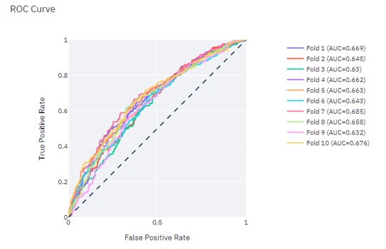

### XAI Dashboard
The XAI dashboard allows you to inspect the behavior of your scikit-learn machine learning model and can be a useful tool during and after model development. It contains various pages that group together similar types of functionality for exploring either your data or the behavior of your model. The different pages that are currently functional are as follows:

1. **Settings**: page from where explainers and input data can be selected and SHAP values can be calculated. States of variables of the entire dashboard can be observed here as well. 
1. **Terms explained**: Explanation for certain methods and terminology, especially for SHAP and the non-conformal framework.
2. **Data analysis**: Basic data exploration and number crunching. Currently only available for the implementation set.
3. **Global explanations**: Explore plots of global model behavior, including predictions, confidence, Partial Dependence plots and SHAP values the entire dataset.
4. **Local explanations**: Explore plots of local model behavior, such as SHAP plots explaining the predictions with different visualisation or the confidence index, for individual rows. 
5. **Confidence analysis**: Explore model confidence and predictions for combinations of variables. Model confidence can be per prediction of per dataset.
6. **Model performance**: Explore model performance from a cross-validation setting. Metrics include both precision-recall and ROC curves, together with a confusion matrix, general metrics like accuracy, precision and recall. Also includes a precision/recall @ k plot, which can be useful for determining ranking performance of the model.

### Prerequisites
The dashboard requires the user to supply certain files to enable most of the functionality. The mandatory files are as follows:
- **Implementation / Out of Sample (OOS) set**. The dataset (not part of the train/testing process) used for exploring the model's behavior on new data. This file should be put in the data/implementation_set folder. It has to preprocessed such that it can be fed to the model without further modification.
- **Development set**. This csv is used for computing model performance found in the training set. This should be a csv with one row for each training example. It should contain the following three columns:
   1. The target value for each row
   1. The model prediction for each row
   1. The fold that the row belonged to during cross-validation. With K folds, this should be a number between 0 and K - 1.
   This file should be placed in the data/development_set folder.
- **The (scikit-learn) model** stored in .joblib or .pickle format. This file should be placed in the models/ folder.

For more functionality, optional files can be supplied. If these are not supplied, the associated functionality is disabled when running the dashboard. The optional files include the following:
   - **Calibration set** for confidence estimation. The non-conformal framework requires a test set for calibrating its confidence estimator. This test set should be separate from the sets used during training. This file should be placed in the data/calibration_set folder.

### How to run:
1. Navigate to the XAI dashboard project folder in a terminal
1. Run the bash script as follows: *bash run.sh*
1. You will be prompted to create a new environment. Answer 'y' if this is the first time you're running the dashboard. A new environment will be installed.
1. If no SHAP explainer is present yet, shap values for the provided implementation set will have to be computed and loaded from the Settings page. This can take a while, depending on the size of the dataset.
1. The dashboard will launch on a specific port which will be displayed in the terminal. To use the dashboard, navigate to https://jupyter.ilt.rijkscloud.nl/user/username/proxy/portnumber/
1. If this is the first time using the dashboard with a model, SHAP values must be calculated and loaded. To do that, simply click on the 'Calculate SHAP button'. If the dataset is large, the dashboard might time-out. If that happens, just restart the Dashboard and the SHAP explainer should be there. Remember to Load everytime the dashboard is started. 
1. If there is a calibration set available, type the target variable (column name) in the lowest textbox and then click on 'Train Non-Conformal Classifier'. Now the Confidence Interval metric will be available, too.

### Use case with Screenshots

Below some screenshots from the Dashboard on some potential uses of different pages and plots. The model described here is used to detect end-of-life ships that need to be inspected because they might be illegally scrapped otherwise. For starters we can investigate basic model performance and global feature importance using SHAP. 

#

We notice that physical characteristics of ships play an important role. Let's dive deeper to see how they influence the model score. 
We can get a slighltly detailed understanding if we look at at a beeswarm plot. Here we can see that most low tonnage ships score a positive shap value, while higher (red) tonnage decreases the prediction score. Same for previous inspection numbers. We know from discussing with inspectors that specific types of ships used to be built in different times. A good idea is to check other features in combination with tonnage to get more granularity of data. 

If we plot a 3D partial dependency plot, we see the direct relationship between model score and features. We can now clearly observe that young, large ships score the lowest, while old, small ships have the highest inspection risk associated with them. We can also dig deeper to find the years that define these groups, with a SHAP partial dependency plot. 

We notice a clear distinction between ships built before 1975 and afterwards, with larger ships being built more recently. However there is an interaction between small and large, young ships, and perhaps other features will differentiate these subgroups even further. 

Another reason why our model might treat young ships in a different way than older ones, is due to the splits in the train/test datasets. In the Data Analysis page of the Dashboard, you can get at a glance difference in statistics between datasets and some histogram plots. In this case, we notice a skew in the train set towards younger ships, while the test set has significantly lower numbers of young ships. 

